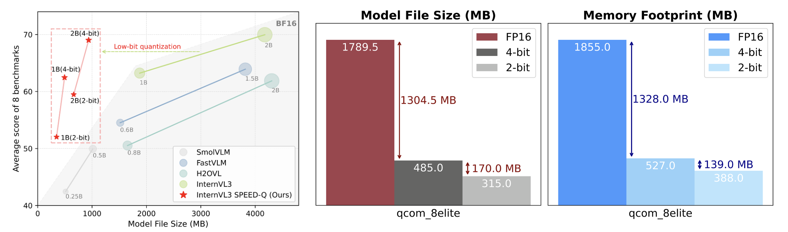

<h1 align='left'>SPEED-Q</h1>

<div align='left'>
    <a href='https://arxiv.org/2511.08914'></a>
    <a href='https://huggingface.co/BadToBest'></a>
</div>

This is an official implementation of **"SPEED-Q: Staged Processing with Enhanced Distillation Towards Efficient Low-Bit On-Device VLM Quantization"** in AAAI 2026. It's a novel framework for low-bit on-device weight-only VLM quantization.

<div align="center">
  
</div>

## &#x1F4E3; Updates
* [2026.01.16] 🔥 Our [Code](https://github.com/antgroup/SPEED-Q) is in public on Github. Models are to be released. 
* [2025.11.12] 🔥 Our [paper](https://arxiv.org/abs/2511.08914) is in public on arxiv. 

## &#x1F305; Gallery

### 🎥 Demo

These demos showcase **on-device inference in a completely offline environment**, where all computations are performed locally on the edge device without any network connectivity.

<table class="center">
<tr>
    <td width=25% style="border: none">
        
    </td>
    <td width=25% style="border: none">
        
    </td>
    <td width=25% style="border: none">
        
    </td>
    <td width=25% style="border: none">
        
    </td>
</tr>
</table>

### 📊 Qualitative Results

<div align="center">
  
</div>

## 🚀 Quick Start
### 🛠️ Environment Setup

    

- Tested GPUs: A100(80G) / PPUE (80G)

```bash
# Install libraries
$ pip install -r requirements.txt
```

### 🧱Model and Data Preparation

| Models        |                       Download Link                                           |
| --------------|-------------------------------------------------------------------------------|
| InternVL3-1B  |      🤗 [Huggingface](https://huggingface.co/OpenGVLab/InternVL3-1B)          | 
| InternVL3-2B  |      🤗 [Huggingface](https://huggingface.co/OpenGVLab/InternVL3-2B)          |

Data format is referenced from https://huggingface.co/datasets/Ahren09/llava_zh, and details of the datasets used can be found in the paper's appendix. The final list of datasets used can be found in: `data/training_dataset.json`.

### 📝 Training

Example for the quantization process of InternVL3-1B.

#### Stage1: ViT is quantized using an image-only calibration set.

For the quantization of the ViT, we use the block-wise AdaRound, code is based on https://github.com/yhhhli/BRECQ. The quantized weights of the ViT will be uploaded later.

#### Stage2: Projector is trained to better align the quantized ViT (qViT).

```bash
$ bash stage2_internvl3_1b_2bit_proj.sh
```

- `SAVE_DIR`: Path to the save logs and weights
- `MODEL_PATH`: Path to the VLM
- `TEACHER_MODEL_PATH`: Path to the bf16 teacher VLM
- `QUANT_VIT_PATH`: Path to the quantized ViT weights

#### Stage3: qViT is frozen, the projector and LLM undergo quantization-aware training.

```bash
$ bash stage3_internvl3_1b_2bit_qat.sh
```

### 🤗 Evaluation

The quantized weights of the SPEED-Q will be uploaded later.

#### Dequantize to the float model.

```bash
$ bash save_fake_quant.sh
```

#### Eval with VLMEvalKit.

We evaluate the quantized VLMs using VLMEvalKit.

```bash
model_name="InternVL3-1B-SPEED-Q-2bit"
python run.py --data HallusionBench --model ${model_name} --verbose
python run.py --data AI2D_TEST --model ${model_name} --verbose
python run.py --data OCRBench --model ${model_name} --verbose
python run.py --data MMBench_DEV_EN_V11 --model ${model_name} --verbose
python run.py --data MMBench_DEV_CN_V11 --model ${model_name} --verbose
python run.py --data MMStar --model ${model_name} --verbose
python run.py --data MMMU_DEV_VAL --model ${model_name} --verbose
python run.py --data ScienceQA_VAL --model ${model_name} --verbose
python run.py --data SEEDBench_IMG --model ${model_name} --verbose
```

## 📝 TODO List

| Status | Milestone                                                                |     
|:--------:|:-------------------------------------------------------------------------|
|    ✅    | Open-source release of SPEED-Q code on GitHub   | 
|    🚀    | Release the `InternVL3-1B-2/4bit-SPEED-Q` models on Hugging Face, including both ViT and VLM components with quantized weights and corresponding dequantized floating-point weights |
|    🚀    | Provide comprehensive documentation and code for quantization parameters |


## &#x1F4D2; Citation

If you find our work useful for your research, please consider citing the paper:

```
@misc{guo2025speedq,
  title={SPEED-Q: Staged Processing with Enhanced Distillation Towards Efficient Low-Bit On-Device VLM Quantization},
  author={Tianyu Guo, Shanwei Zhao, Shiai Zhu, Chenguang Ma},
  year={2025},
  eprint={2511.08914},
  archivePrefix={arXiv}
}
```

## 📜 Reference
- InternVL: https://github.com/OpenGVLab/InternVL
- VLMEvalKit: https://github.com/open-compass/VLMEvalKit

## 🔑 License
The models in this repository are licensed under the Apache 2.0 License.